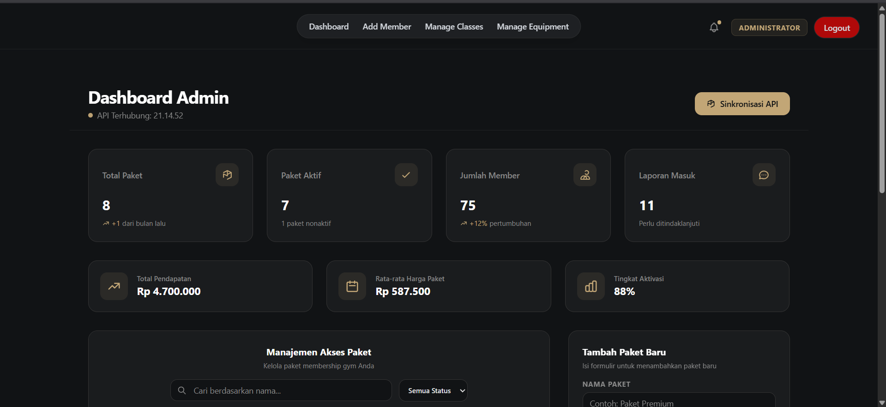
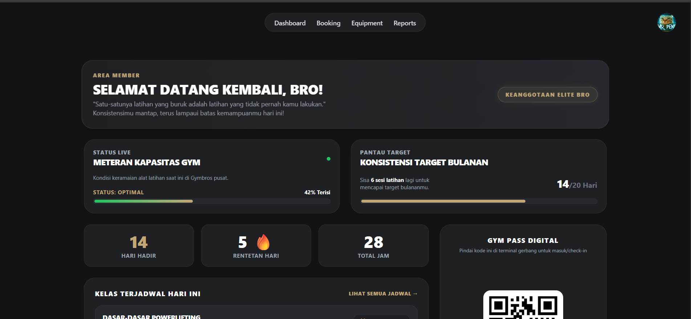

# Gym Management System

> Modern gym management platform built with React and Node.js to simplify gym operations, membership handling, and class booking in one integrated web application.

---

## Preview

<p align="center">
  
</p>

---

# About The Project

Gym Management System adalah aplikasi berbasis web yang dirancang untuk membantu industri gym dalam mengelola member, kelas, membership, dan aktivitas administrasi secara efisien.

Aplikasi ini menggunakan arsitektur modern berbasis:

- Frontend: React.js
- Backend: Node.js + Express.js
- Database: MongoDB / MySQL
- Authentication: JWT Authentication
- UI Design: Dark Elegant Theme

Sistem memiliki dua role utama:

1. Admin
2. Member

---

# Features

## Member Features

- Edit profile member
- Melihat daftar kelas gym
- Booking kelas secara online
- Melihat riwayat booking
- Melihat status membership
- Dashboard member interaktif
- Responsive modern UI
- Secure authentication system

## Admin Features

- CRUD member
- Ban & delete member
- Membuat akun member
- CRUD kelas gym
- CRUD membership package
- Monitoring booking member
- Dashboard analytics
- Manajemen data gym secara real-time

---

# Tech Stack

| Technology | Description |
|---|---|
| React.js | Frontend Framework |
| Node.js | Backend Runtime |
| Express.js | REST API Framework |
| MongoDB / MySQL | Database |
| JWT | Authentication |
| Tailwind CSS / CSS | Styling |
| Git & GitHub | Version Control |

---

# System Architecture

```bash
Client (React.js)
        ↓
REST API (Node.js + Express)
        ↓
Database (MongoDB / MySQL)
```

---

# Installation

## Clone Repository

```bash
git clone https://github.com/gaktawu/GymBros
```

## Frontend Setup

```bash
cd client
npm install
npm run dev
```

## Backend Setup

```bash
cd server
npm install
npm run start
```

---

# Project Structure

```bash
menyusul
```

---

# Main Goals

Aplikasi ini dibuat untuk:

- Mempermudah pengelolaan gym
- Mengurangi proses administrasi manual
- Mempermudah booking kelas
- Meningkatkan efisiensi operasional gym
- Memberikan pengalaman digital modern untuk member gym

---

# UI Concept

Tema aplikasi menggunakan konsep:

- Dark Mode Elegant
- Minimalist Dashboard
- Modern Fitness Industry Design
- Clean User Experience
- Responsive Layout

---

# Security

- JWT Authentication
- Protected Routes
- Password Hashing
- Role-Based Access Control
- Secure REST API

---

# Future Development

- Payment Gateway Integration
- QR Attendance System
- AI Workout Recommendation
- Mobile App Version
- Push Notification
- Gym Analytics Dashboard

---

# Screenshots Idea

## Admin Dashboard

<p align="center">
  
</p>

## Member Dashboard

<p align="center">
  
</p>

---

# Author

### Developed by Pentit

Mahasiswa Informatika dengan minat pada:

- Web Development
- Backend Engineering
- System Design
- Fitness Technology

---

# License

This project is licensed under the MIT License.

---

<p align="center">
  <b>“Train Smart. Manage Smarter.”</b>
</p>
